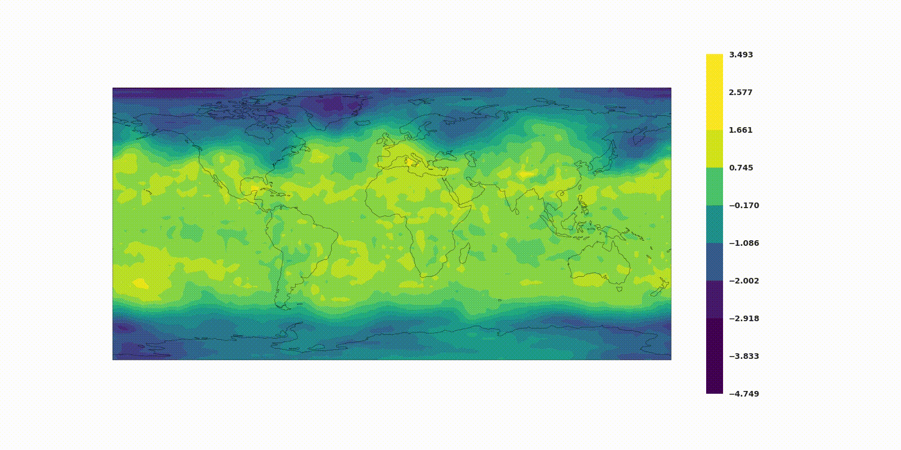
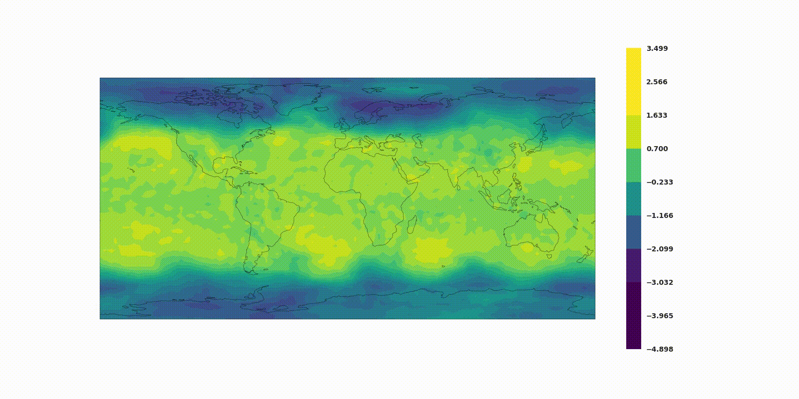

# Producing-realistic-climate-data-with-GANs

Associated repository to the article Producing realistic climate data (10.5281/zenodo.4436274)

# Interpolation example

Radial interpolation :

linear interpolation in latent space :

linear interpolation in image space :

Spherical interpolation :

